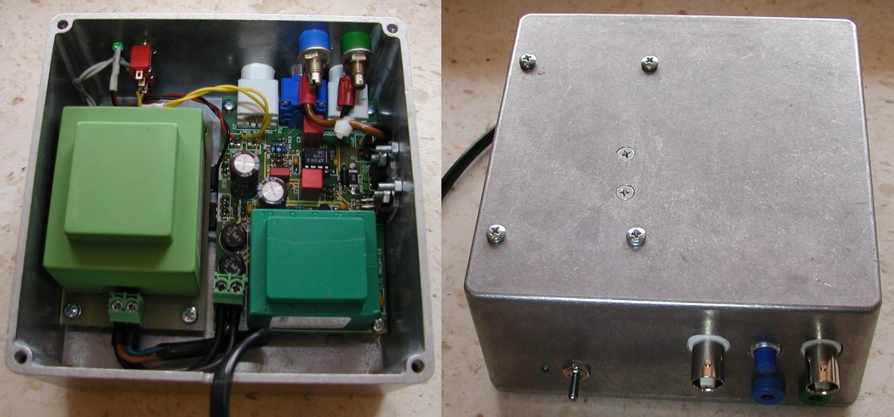

LTC [AN104](http://www.linear.com/docs/29876) Closed loop load transient tester (with on board power supply) 

**Please note that max. allowed D.U.T voltage is determined with switching transistor SOA.**

**********************

Repository: www.github.com/eez-open
Web site: www.envox.hr/eez

**********************

*EEZ 2-layer (+tKeepout +_tNames) *job script is used for generating Gerber files. Use [gerbv](http://gerbv.geda-project.org/), a free/open source Gerber viewer to inspect generated files.
